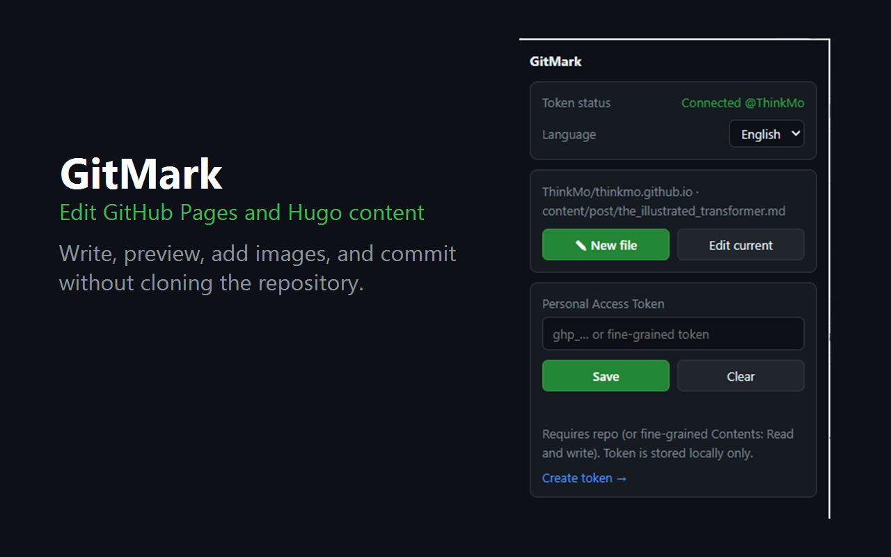
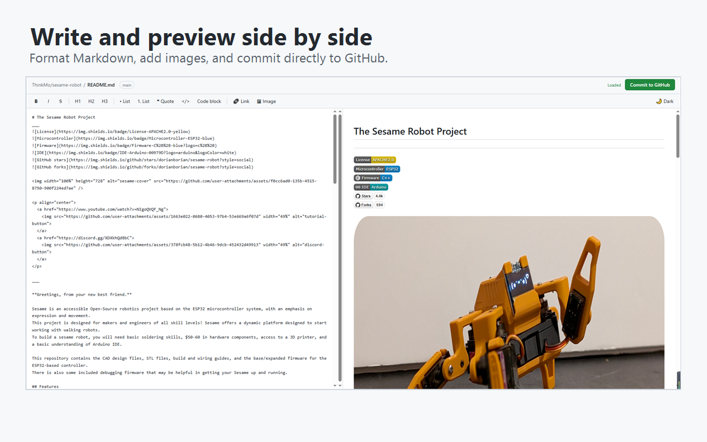
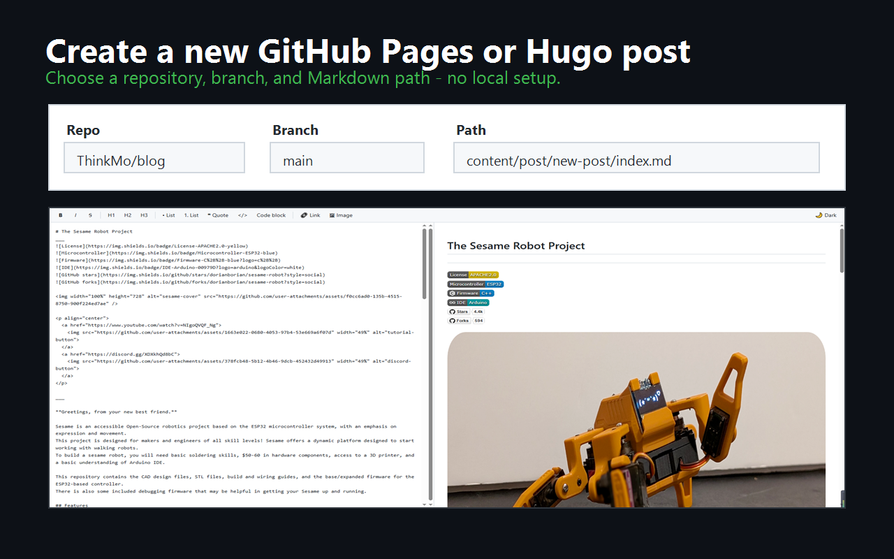
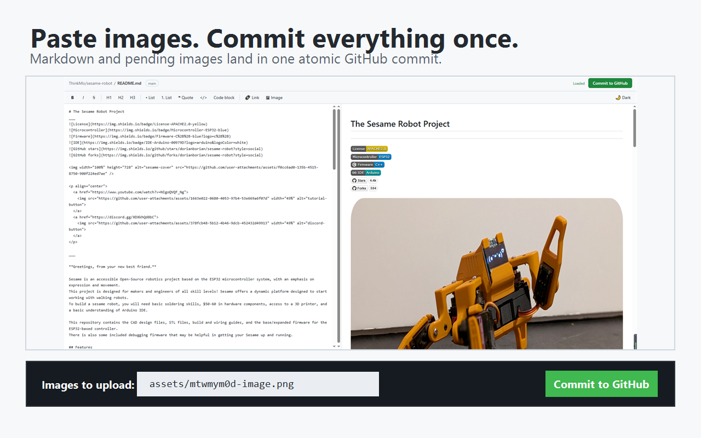

+++
keywords = ["GitMark", "GitHub Pages", "Hugo", "Markdown", "Chrome extension"]
title = "GitMark：在浏览器中直接编辑Markdown的Chrome插件"
slug = "gitmark"
categories = ["tools"]
disqusIdentifier = "gitmark"
comments = true
clearReading = true
date = 2026-09-16T08:00:00+08:00
showSocial = false
showPagination = true
showTags = true
showDate = true
+++

在维护 GitHub Pages 或 Hugo 博客时，经常只想改一个错字、补一段说明或上传一张图片，却仍要拉取仓库、打开编辑器、执行 Git 命令再推送。电脑上没有准备好开发环境时，这套流程更显得麻烦。

[GitMark](https://github.com/ThinkMo/gitmark) 是我为这类场景开发的一款开源 Chrome 扩展。它可以直接读取 GitHub 仓库里的 Markdown 文件，在浏览器中完成编辑、预览和提交，也可以新建文章。提交完成后，原有的 GitHub Pages 或 GitHub Actions 工作流继续负责构建和发布网站。

<!--more-->



## 它解决了什么

GitMark 面向以 Markdown 为内容源的仓库，尤其适合 GitHub Pages、Hugo 博客、项目文档和 README。主要功能包括：

- 从 GitHub 文件页面一键打开当前 Markdown；
- 左侧编辑、右侧实时预览，并提供常用格式工具；
- 新建 `.md`、`.markdown` 和 `.mdx` 文件；
- 粘贴、拖放或选择本地图片，自动插入相对路径；
- 将 Markdown 与待上传图片放进同一次原子提交；
- 更新已有文件前检测远端冲突，避免覆盖其他修改；
- 支持中英文界面以及浅色、深色主题。



GitMark 展示的是 Markdown 实时预览，不会在浏览器里完整运行 Hugo 主题。短文修改、排版和图片引用可以当场确认；主题模板、Shortcode 或站点构建结果，仍由 Hugo 和现有发布流程处理。

## 安装与配置

可以从 [Chrome Web Store 安装 GitMark](https://chromewebstore.google.com/detail/gitmark/ihbciobhmpfemphhdpeajkpbldmdgocb)。安装后建议将扩展固定到工具栏，方便随时打开。

GitMark 通过 GitHub Personal Access Token 访问仓库。推荐创建 Fine-grained token，只选择需要维护的仓库，并将 **Contents** 权限设为 **Read and write**。把 Token 保存到扩展后，出现 `Connected @用户名` 就表示连接成功。

Token 保存在 Chrome 的本地扩展存储中。GitMark 没有自建服务器、广告、分析或跟踪；读取文件和提交内容时，必要数据只会通过 HTTPS 发送到 GitHub 官方 API。

## 编辑已有文章

在 GitHub 打开一个 Markdown 文件后，可以点击页面中的 **GitMark** 按钮，或者打开扩展并选择 **Edit current**。修改内容时右侧预览会同步更新，完成后点击 **Commit to GitHub**，填写提交说明并确认即可。

如果文件在编辑期间已被其他提交修改，GitMark 会中止本次提交并提示重新载入，避免悄悄覆盖远端的新内容。

## 新建 Hugo 文章

在扩展弹窗中选择 **New file**，依次填写仓库、分支和文件路径。对于使用页面包的 Hugo 博客，可以把新文章路径写成：

```text
content/post/article-name/index.md
```

GitMark 会尽量根据当前 GitHub 页面自动填写仓库和分支。目标路径已经存在时，新建操作会被拦截，防止覆盖原文件。



## 图片与 Hugo 页面包

图片可以直接粘贴到编辑区，也可以拖入或通过工具栏选择。GitMark 会把待上传图片放在 Markdown 文件同级的 `assets/` 目录中，并插入相对引用。例如：

```text
content/post/article-name/
├── index.md
└── assets/
    └── cover.png
```

```markdown

```

这正是 Hugo Leaf Bundle（页面包）适合处理本地文章图片的方式。目录也可以命名为 `images/`；关键是图片位于文章页面包内，并在 Markdown 中使用相对于 `index.md` 的路径。这样 GitHub 能直接显示图片，Hugo 构建后也能生成正确地址。

提交时，正文与新增图片会一起写入同一个 Git commit，不会出现文章已经引用图片、图片却尚未上传的中间状态。



## 使用边界

GitMark 专注于直接编辑并提交仓库内容，不会替代 Hugo 构建，也不会自动创建 Pull Request。受保护分支可能禁止直接提交，此时应写入允许提交的分支，再按仓库流程创建 Pull Request。图片上传也会受到 GitHub API 文件大小和请求限制。

如果你经常维护 GitHub Pages、Hugo 博客或仓库文档，可以在 [Chrome Web Store](https://chromewebstore.google.com/detail/gitmark/ihbciobhmpfemphhdpeajkpbldmdgocb) 安装体验。项目代码已在 [GitHub](https://github.com/ThinkMo/gitmark) 开源，问题和建议也欢迎通过 Issues 反馈。
