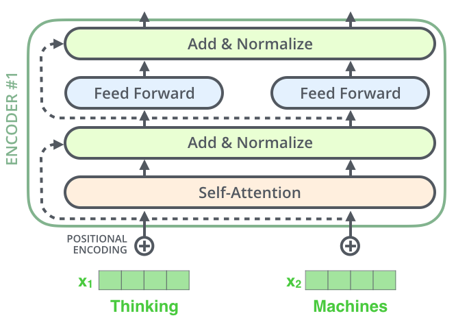
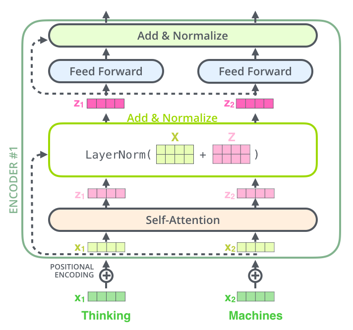
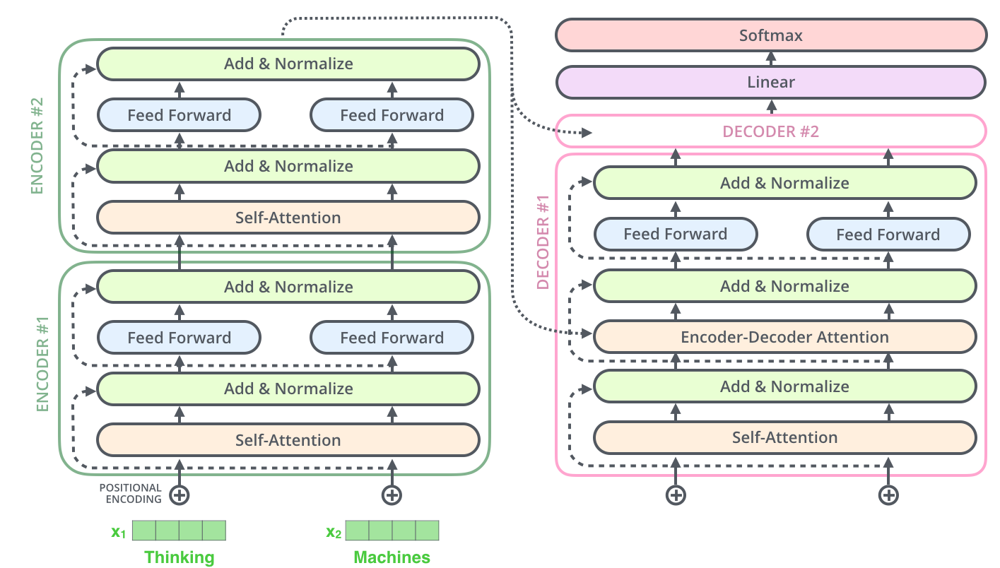
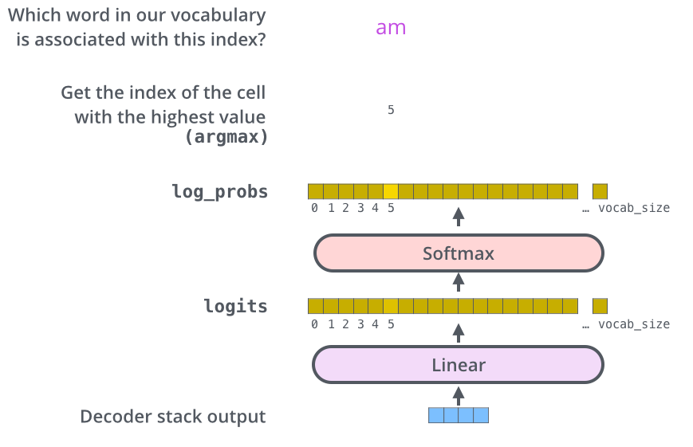
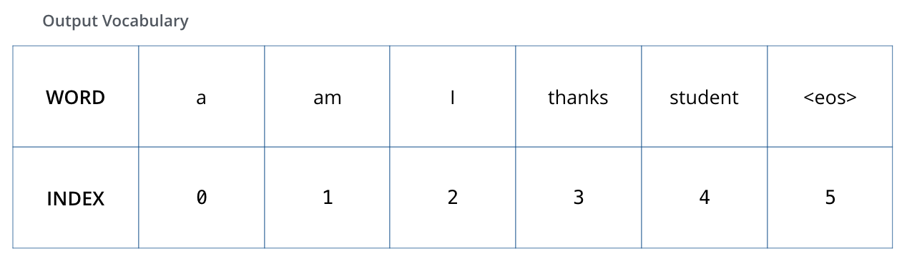
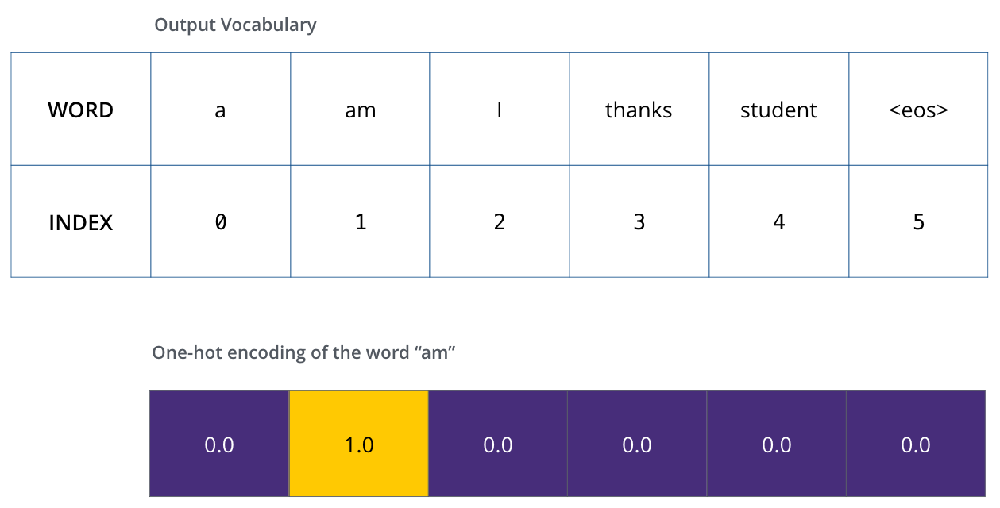
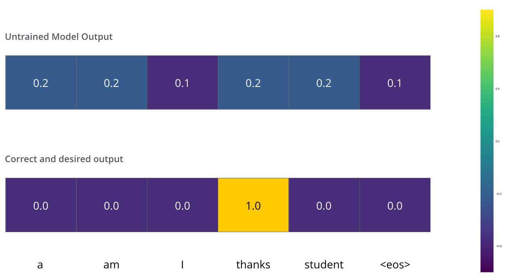
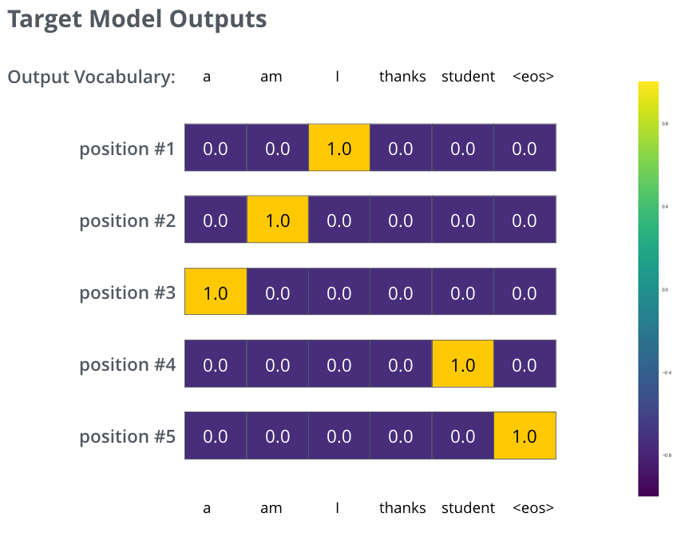
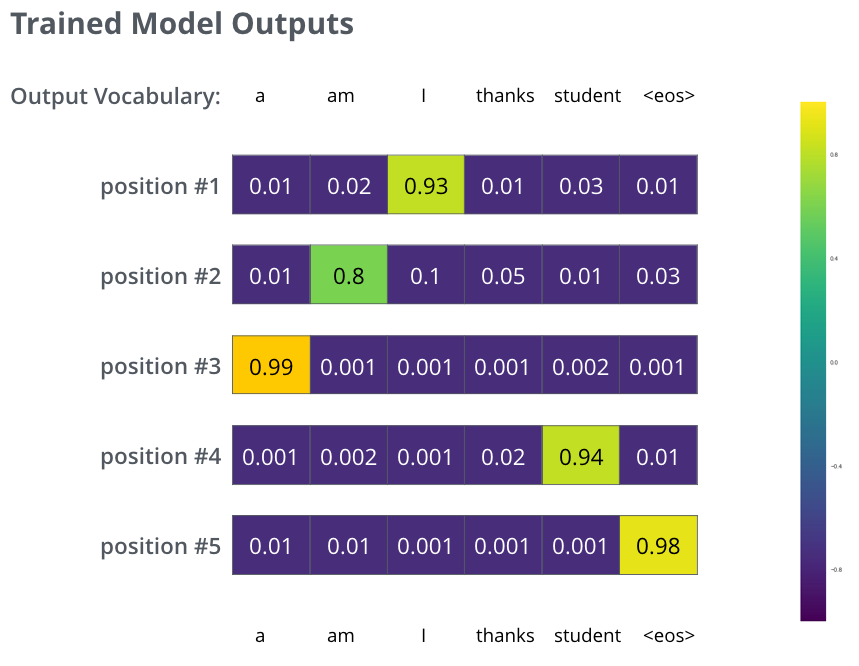

+++
keywords = ["transfromer"]
title = "图解transfromer(译)"
categories = ["llm"]
disqusIdentifier = "llm_transformer"
comments = true
clearReading = true
date = 2026-09-11T10:31:44+08:00 
showSocial = false
showPagination = true
showTags = true
showDate = true
+++

# 图解transformer(译)

> 本文翻译自 Jay Alammar 的[The Illustrated Transformer](https://jalammar.github.io/illustrated-transformer/)

在之前的[博文](https://jalammar.github.io/visualizing-neural-machine-translation-mechanics-of-seq2seq-models-with-attention/)中我们阐述了注意力机制--一项被广泛应用于现代深度学习模型的技术。注意力机制可以有效提升机器翻译应用的性能。在本文中我们将介绍Transformer--该模型利用attention来加速模型训练。在处理某些任务方面Transformer表现优于google神经翻译模型，其最大优势在于支持并行处理。google cloud建议使用google tpu服务使用Transformer作为推理模型，让我们一起看下Transformer模型如何实现的。

在[Attention is All You Need](https://arxiv.org/abs/1706.03762)中首次提出Transformer，Harvard'NLP 用[Pytorch阐述并实现了Transformer](https://nlp.seas.harvard.edu/annotated-transformer/)，在本文中我们将对逐步介绍相关概念，简化内容，帮助无相关背景知识的人也能理解其原理。

## 总体概览

我们将Transformer模型当作黑盒来看，在机器翻译应用中，其接收某种语言的一个语句作为输入，输出对应的另一种语言对应结果。

深入Transformer内部，我们可以看到两个相连的组件，分别为encoding、decoding。

encoding组件由一组encoders组成，同样的，decoding组件由同样数量decoders组成。

所有encoders在架构上是一致的，当然不同encoders有着不同的权重参数，每一个encoder都可以拆分为两层(self-attention和FNN)：

encoder的输入首先会经过自注意力层：该层会帮助encoder在编码某个单词的同时考虑输入句子中其他位置单词的含义。在后文中我们会详细阐述自注意力机制。

从自注意力层出来后会进入前向神经网络，句子中所有位置都会独立的经过相同的前向神经网络处理。

decoder同时包含以上两层，同时在两层之间还包含一层注意力层，帮助decoder专注于输入句子中相关的部分。

## 了解向量

我们已经了解了Transformer的主要组件，现在来看下不同的向量/张量在组件中如何被处理，了解训练好的模型如何将输入转化为输出。

通常在自然语言处理中，我们会通过向量嵌入算法将输入的每一个词转化为向量。

向量化处理仅发生在编码器的最底层，所有编码器都接收一个由多个向量组成的列表，每个向量的大小为512(可以理解为上下文窗口大小)。在最底层的编码器中，这些向量就是向量化词嵌入；而在其他编码器中，输入向量则是下方的编码器的输出结果。这个列表的大小是我们可以设置的超参数——实际上，它应该等于我们训练数据集中最长的句子的长度。

输入的句子会被转化为嵌入向量，并输入到编码器中，其中每个词都会经过编码器的两层结构。

现在我们可以看到Transformer的一个关键特性：在自注意力层，句子中的每一个词会沿着自己所在位置被编码器进行处理，在注意力层它们之间的位置是相互依赖的；而在FNN中没有依赖关系，可以并行的处理。

接下来，我们会将示例简化为更短的句子，然后观察编码器的每个子层会发生什么情况。

## 编码

正如前文所述，编码器接收一个向量序列作为输入。这些向量先经过“自注意力”层，再经过前馈神经网络，处理后的结果随后向上传递给下一层编码器。

如上图所示，每个位置上的词都会经过自注意力处理。随后，各个词对应的向量分别经过前馈神经网络——它们使用的是同一个网络，但每个向量都独立通过(并行处理)该网络。

### 自注意力概览

我一直把“自注意力”挂在嘴边，好像这是个人人都该熟悉的概念，但别被这种说法唬住了。我自己也是在阅读《Attention Is All You Need》这篇论文时，才第一次接触到这个概念。下面我们来抓住要点，看看它是如何工作的。

假设我们要翻译的输入句子如下：
> The animal didn't cross the street because it was too tired

句子中的“it”（它）指的是什么？是街道，还是那只动物？对人来说，这个问题很简单；对算法来说，却没那么容易。当模型处理“it”这个词时，自注意力机制使模型能够将“it”与“animal”（动物）联系起来。模型在处理每个词，也就是输入序列中的每个位置时，自注意力机制使它能够查看序列中的其他位置，从中寻找线索，从而为当前词生成更好的编码表示。

如果你熟悉循环神经网络（RNN），可以想一想：RNN 通过维护隐藏状态，将之前处理过的词或向量的表示，与当前正在处理的词或向量结合起来。而 Transformer 使用自注意力机制，将对其他相关词的“理解”融入当前词的表示中。

*当我们在编号为 5 的编码器，也就是编码器堆栈最顶层的编码器中，对“it”进行编码时，注意力机制的一部分会关注“The Animal”，并将其部分表示融入“it”的编码中。*

可以通过 [Tensor2Tensor NoteBook](https://colab.research.google.com/github/tensorflow/tensor2tensor/blob/master/tensor2tensor/notebooks/hello_t2t.ipynb)，加载 Transformer 模型，并通过这种交互式可视化方式来观察模型。

### 自注意力详解

我们先看看如何用向量计算自注意力，再看看实际实现中如何用矩阵完成这些计算。

计算自注意力的**第一步**，是根据编码器的每个输入向量——在这里就是每个词的嵌入向量——生成三个向量。因此，对于每个词，我们都会生成一个查询向量（Query）、一个键向量（Key）和一个值向量（Value）。具体做法是：将该词的嵌入向量分别乘以三个权重矩阵；这些矩阵的参数是在训练过程中学到的。

注意，这些新向量的维度比嵌入向量小。它们的维度为 64，而嵌入向量以及编码器的输入、输出向量的维度都是 512。新向量的维度并非必须更小；这是一种架构设计选择，目的是让多头注意力的总计算量大体保持不变。

*将 \(x_1\) 乘以权重矩阵 \(W^Q\)，就会得到 \(q_1\)，即该词对应的“查询”向量。最终，我们会为输入句子中的每个词分别生成“查询”“键”和“值”三种投影表示。*

“查询”“键”和“值”向量究竟是什么？

它们是帮助我们计算和理解注意力的抽象概念。继续阅读下面的注意力计算过程后，你就能基本理解这些向量各自发挥的作用。

计算自注意力的**第二步**，是计算分数。假设我们正在为本例中的第一个词“Thinking”（思考）计算自注意力，就需要以这个词为参照，对输入句子中的每个词进行评分。这些分数决定了：在对某个位置的词进行编码时，应该对输入句子的其他部分投入多少注意力。

分数通过点积计算得到：将当前词的查询向量，与被评分词的键向量做点积。因此，如果我们正在计算第 1 个位置上的词的自注意力，那么第一个分数就是 \(q_1\) 与 \(k_1\) 的点积，第二个分数就是 \(q_1\) 与 \(k_2\) 的点积。

**第三步和第四步是**：先将这些分数除以 8，再对结果进行 softmax 运算。这里的 8 是论文中键向量维度 64 的平方根，这样做**有助于使梯度更加稳定**。也可以采用其他缩放值，但这里默认使用这一数值。**Softmax 会将分数归一化**，使它们都为正数，并且总和为 1。

经过 softmax 得到的分数，决定了各个词的信息会以多大的比重体现在当前位置的表示中。显然，当前位置上的词本身会获得最高的 softmax 分数(自注意力不保证当前词对自身的注意力权重最高，其他词完全可能获得更高权重)，但有时，关注另一个与当前词相关的词也很有帮助。

**第五步**，是将每个值向量乘以它对应的 softmax 分数，为后续求和做准备。直观上，这样做是为了尽可能保留我们想要关注的词所包含的信息，同时削弱无关词的信息——例如，将其乘以 0.001 这样很小的数。

**第六步**，是将这些加权后的值向量相加。所得结果就是自注意力层在当前位置，也就是第一个词所在位置的输出。

至此，自注意力的计算就完成了。得到的向量可以继续传入前馈神经网络。不过，在实际实现中，为了提高处理速度，这些计算会以矩阵形式进行。现在我们已经从单个词的层面直观理解了计算过程，接下来就看看矩阵形式的计算。

### 自注意力中的矩阵计算

**第一步**是计算Query矩阵、Key矩阵和Value矩阵。我们先将各个词的嵌入向量排列成矩阵 \(X\)，再将 \(X\) 分别乘以训练得到的权重矩阵 \(W^Q\)、\(W^K\) 和 \(W^V\)。

*矩阵 \(X\) 中的每一行，都对应输入句子中的一个词。这里再次展示了嵌入向量与 q/k/v 向量在维度上的差异：前者为 512 维，在图中用 4 个方格示意；后者为 64 维，在图中用 3 个方格示意。*

最后，由于采用了矩阵形式，我们可以将第二步到第六步合并为一个公式，用来计算自注意力层的输出。

### 多头机制

论文通过引入一种称为“多头注意力”的机制，进一步改进了自注意力层。这种机制从两个方面提升了注意力层的表现：

1. 它增强了模型关注不同位置的能力。在上面的例子中，\(z_1\) 确实包含了其他各个位置编码中的少量信息，但其中仍可能主要是当前词自身的信息。如果我们要翻译“The animal didn’t cross the street because it was too tired”（那只动物没有穿过街道，因为它太累了）这样的句子，知道“it”指代哪个词就会很有帮助。
2. 它为注意力层提供了多个“表示子空间”。接下来我们会看到，在多头注意力中，查询、键和值的权重矩阵不再只有一组，而是有多组。这里的 Transformer 使用 8 个注意力头，因此每个编码器或解码器中的相应注意力模块都有 8 组权重矩阵。每组矩阵都会随机初始化。训练完成后，各组矩阵分别用于将输入嵌入向量，或来自下层编码器、解码器的向量，投影到不同的表示子空间。

*在多头注意力中，每个注意力头都有各自独立的 Q/K/V 权重矩阵，因此会生成不同的 Q/K/V 矩阵。与前面一样，我们将 \(X\) 分别乘以 \(W^Q\)、\(W^K\) 和 \(W^V\)，得到 \(Q\)、\(K\) 和 \(V\)。*

如果使用不同的权重矩阵，将前面介绍的自注意力计算分别执行 8 次，就会得到 8 个不同的 \(Z\) 矩阵。

这就带来了一个小问题：前馈层需要的输入并不是 8 个矩阵，而是一个矩阵，其中每个词对应一个向量。因此，我们需要想办法将这 8 个矩阵合并成一个矩阵。

具体怎么做呢？先将这些矩阵拼接起来，再乘以一个额外的权重矩阵 \(W^O\)。

多头自注意力的主要内容基本就是这些。我知道，这里面涉及的矩阵确实不少。下面我试着把它们放进同一张图中，方便我们集中查看。

现在我们已经了解了注意力头，再回到前面的例句，看看在对“it”进行编码时，不同注意力头分别关注哪些地方：

*在对“it”进行编码时，一个注意力头主要关注“the animal”，另一个则主要关注“tired”（累的）。从某种意义上说，模型对“it”的表示，同时融入了“animal”和“tired”的部分表示信息。*

不过，如果把所有注意力头都加入图中，结果就会变得更难解读：

### 位置编码

到目前为止，我们所描述的模型还缺少一种机制，用来表示输入序列中各个词的先后顺序。

为了解决这个问题，Transformer 会在每个输入嵌入向量上加上一个向量。这些附加向量遵循特定的模式，模型可以学习利用这种模式，判断每个词的位置，或者序列中不同词之间的距离。直观地说，将这些数值加入嵌入向量后，当嵌入向量被投影为 Q/K/V 向量并参与点积注意力计算时，模型就能够利用其中蕴含的位置信息.

*为了让模型感知词的顺序，我们加入了位置编码向量，这些向量中的数值遵循特定的模式。*

假设嵌入向量的维度为 4，那么实际的位置编码会如下所示：

*一个实际的位置编码示例，为便于演示，将嵌入维度设为 4。*

这种模式具体是什么样的呢？

在下图中，每一行都对应一个位置编码向量。因此，第一行就是要加到输入序列中第一个词的嵌入向量上的向量。每行包含 512 个数值，每个数值都介于 −1 和 1 之间。我们用颜色表示这些数值，以便直观地观察它们的模式。

*这是一个实际的位置编码示例，包含 20 个词的位置（行），嵌入维度为 512（列）。可以看到，图像似乎从中间分成了左右两半。这是因为左半部分的数值由一个使用正弦的函数生成，右半部分则由另一个使用余弦的函数生成。随后，将这两部分拼接起来，形成每个位置的位置编码向量。*

论文第 3.5 节给出了位置编码的公式。你可以在 [get_timing_signal_1d()](https://github.com/tensorflow/tensor2tensor/blob/23bd23b9830059fbc349381b70d9429b5c40a139/tensor2tensor/layers/common_attention.py) 中查看生成位置编码的代码。这并不是位置编码的唯一实现方式，但它有一个优点：能够扩展到训练时未见过的序列长度。例如，我们可能会让训练好的模型翻译一个句子，而它比训练集中的任何句子都长。

2020 年 7 月更新：上面展示的位置编码来自 Tensor2Tensor 对 Transformer 的实现。论文中的方法略有不同：它不是直接拼接这两种信号，而是将它们交错排列。下图展示了这种排列方式，并附有生成它的代码：

### 残差连接

在继续之前，还需要介绍编码器架构中的一个细节：每个编码器中的每个子层，包括自注意力子层和前馈神经网络子层，都有一条经过该子层的残差连接，并且在残差相加之后执行层归一化（Layer Normalization）。

如果将自注意力相关的向量以及层归一化操作可视化，就会如下图所示：

解码器中的各个子层也采用同样的结构。如果一个 Transformer 包含堆叠的两层编码器和两层解码器，那么它的结构大致如下：

## 解码

现在我们已经介绍了编码器部分的大多数概念，因此也基本了解了解码器各个组件的工作原理。接下来看看这些组件如何协同工作。

首先，编码器对输入序列进行处理。随后，最顶层编码器的输出会被转换为注意力计算所需的键向量 \(K\) 和值向量 \(V\)。各层解码器会在自己的“编码器—解码器注意力”层中使用它们，从而关注输入序列中的相关位置：

*编码阶段结束后，就进入解码阶段。在解码阶段，每一步都会生成输出序列中的一个元素；在这个例子中，输出序列就是翻译得到的英文句子。*

后续步骤会重复这一过程，直到生成一个特殊符号，表示 Transformer 解码器已经完成输出。每一步生成的结果都会在下一个时间步作为输入，送入最底层的解码器；随后，各层解码器像编码器一样，将处理结果逐层向上传递。与处理编码器输入时相同，我们也会对解码器的输入进行嵌入，并加入位置编码，以指示每个词的位置。

解码器中的自注意力层，其工作方式与编码器中的自注意力层略有不同：

在解码器中，自注意力层只允许关注输出序列中较早的位置。实现方法是：在自注意力计算的 softmax 步骤之前，屏蔽未来位置，将这些位置对应的注意力分数设为负无穷（-inf）。

“编码器—解码器注意力”层的计算方式与多头自注意力相同，区别在于：它根据解码器中下方子层的输出生成查询矩阵，而键矩阵和值矩阵则由编码器堆栈的输出生成。

## 最后的线性层与Softmax层

解码器堆栈输出的是一个由浮点数组成的向量。我们如何把它转换成一个词呢？这就是最后的线性层及其后面的 Softmax 层所负责的工作。

线性层是一个简单的全连接神经网络层，它将解码器堆栈生成的向量映射为一个维度大得多的向量，称为 logits 向量，即未归一化的分数向量。

假设模型从训练数据集中学到了 10,000 个不同的英文词，它们构成模型的“输出词表”。那么，logits 向量就有 10,000 个分量，每个分量对应一个不同词的分数。这就是我们对模型经过线性层之后的输出的解释。

接着，Softmax 层将这些分数转换为概率，所有概率均为正数，且总和为 1。我们选择概率最高的分量，并将它对应的词作为当前时间步的输出。

*这张图从底部开始，展示了解码器堆栈输出的向量如何最终转换为一个输出词。*

## 回顾训练过程

现在，我们已经介绍了训练好的 Transformer 的完整前向传播过程。接下来，不妨直观地了解一下模型是如何训练的。

在训练过程中，尚未训练好的模型也会执行完全相同的前向传播。不过，由于使用的是带有标签的训练数据集，我们可以将模型的输出与正确答案进行比较。

为了直观展示这个过程，假设输出词表中只有六个词或符号：“a”“am”“i”“thanks”“student”和“<eos>”。其中，<eos> 是“end of sentence”的缩写，表示句子结束。

*模型的输出词表是在训练开始之前的数据预处理阶段建立的。*

确定输出词表之后，就可以用一个维度等于词表大小的向量来表示词表中的每个词。这种表示方式称为独热编码（one-hot encoding）。例如，我们可以用下面的向量表示“am”：

回顾完这些内容后，我们来讨论模型的损失函数。它是训练阶段要优化的指标，我们希望通过优化它，最终得到一个预测非常准确的模型。

## 损失函数

假设我们正在训练模型，而且刚刚进行到训练的第一步。我们使用一个简单的例子：将法语“merci”翻译为英语“thanks”（谢谢）。

这意味着，我们希望模型输出一个指向“thanks”这个词的概率分布。但由于模型还没有经过训练，它目前不太可能做到这一点。

*由于模型的参数，也就是权重，都是随机初始化的，尚未训练的模型会生成一个概率分布，其中各个分量，也就是各个词对应的概率值，还没有学到应有的规律。我们可以将这个分布与正确的目标输出进行比较，再利用反向传播调整模型的权重，使输出更接近我们期望的结果。*

如何比较两个概率分布呢？我们只需将一个减去另一个。更多细节可以参考[交叉熵](https://colah.github.io/posts/2015-09-Visual-Information/)和 [Kullback–Leibler 散度](https://www.countbayesie.com/blog/2017/5/9/kullback-leibler-divergence-explained)（KL 散度）。

不过要注意，这个例子非常简化。在更实际的情形中，我们会使用包含多个词的句子。例如，输入是“je suis étudiant”，期望输出是“i am a student”（我是一名学生）。具体来说，我们希望模型依次输出满足以下条件的概率分布：

- 每个概率分布都由一个维度为 vocab_size，也就是词表大小的向量表示。在这个简化示例中，该值为 6；实际应用中则可能是 30,000 或 50,000。
- 第一个概率分布中，“i”对应的分量具有最高概率。
- 第二个概率分布中，“am”对应的分量具有最高概率。
- 依此类推，直到第五个输出分布指向“<end of sentence>”，即句子结束符。这个符号在包含 10,000 个元素的词表中，也有一个对应的分量。

*图中展示了一个示例句子的目标概率分布，模型将以这些分布为目标进行训练。*

在足够大的数据集上对模型进行充分训练后，我们希望它生成的概率分布如下所示：

*我们希望模型在训练完成后，能够输出预期的正确译文。当然，如果这个句子本身就出现在训练集中，那么仅凭这一结果，并不能真正说明模型的泛化能力，相关内容可参考交叉验证。注意，概率向量中的每个分量都会得到一点概率，即使对应的词几乎不可能成为当前时间步的输出。这是 softmax 的一个有用性质，有助于训练过程。*

由于模型每次只生成一个输出，我们可以让它每一步都从概率分布中选择概率最高的词，并舍弃其他候选。这是一种解码方式，称为“贪心解码”（greedy decoding）。另一种方式是先保留概率最高的两个词，例如“I”和“a”；然后在下一步分别运行模型：一次假设第一个输出词是“I”，另一次假设第一个输出词是“a”。接着，综合考虑第 1 和第 2 个位置的结果，保留误差较小的候选。再继续处理第 2、第 3 个位置，依此类推。这种方法称为“束搜索”（beam search）。在本例中，beam_size 为 2，表示搜索过程中会保留两个部分假设，也就是尚未完成的候选译文；top_beams 也为 2，表示最终返回两个译文。这两个值都是可以通过实验调整的超参数。

## Q & A

